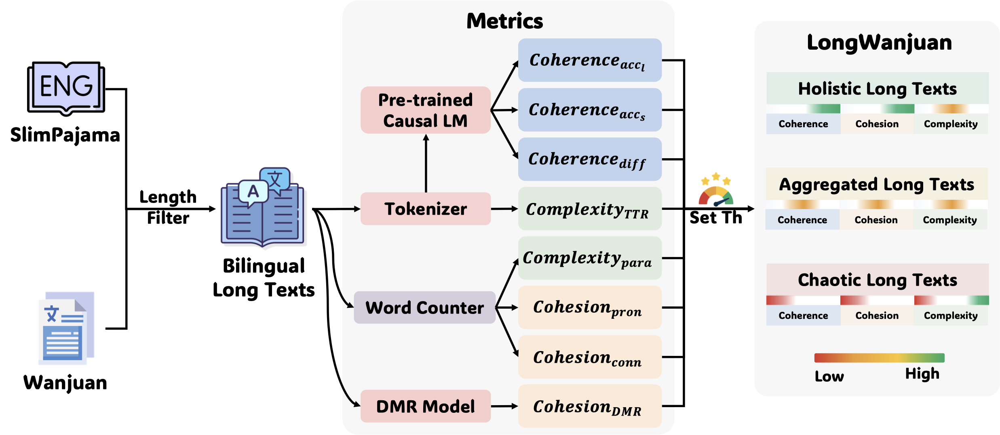

# LongWanjuan
This repository contains the code and data for the paper
**_LongWanjuan: Towards Systematic Measurement for Long Text Quality_**.

## Measurement
To systematically assess the quality of long texts, we adhere to linguistic fundamentals and evaluate them through three dimensions: 
coherence, cohesion, and complexity.

1. **Coherence** refers to the consistency and clarity of the text as a whole. 
A coherent text maintains thematic unity throughout its parts, with logical connections between the different sections. 

2. **Cohesion** measures the degree of tight connection between two sentences or sections of the text, 
reflected in the use of connectives, pronouns, synonyms, and hypernyms/hyponyms.

3. **Complexity** assesses the level of linguistic sophistication in the use of language in the text. 
This can be gauged through the richness and diversity of vocabulary, as well as the complexity of sentence structures. 

To better elucidate these dimensions, we provide examples in the following table.

## Metric
Inspired by the three dimensions mentioned above, we propose the quantitative metrics to assess the quality of long text, 
including both statistical and model-based ones, where higher values correlate with more pronounced characteristics of the corresponding dimension
(code is coming soon).

## LongWanjuan
Based on the analysis and metrics discussed previously, we introduce LongWanjuan, a bilingual long-text dataset with over 160B tokens. 
The pipeline for constructing our dataset is illustrated in the following figure.

[//]: # (An overview of the dataset statistics in the English and Chinese part of LongWanjuan is as follows.)

[//]: # ()
[//]: # (![en_stat]&#40;assets/en_stat.png&#41;)

[//]: # ()
[//]: # (![cn_stat]&#40;assets/cn_stat.png&#41;)

Distribution of token and document counts across different lengths is as follows. 
In LongWanjuan, over 99.9% of the data exceed the truncation length in pre-training.

LongWanjuan is available at [https://opendatalab.com/OpenLMLab/LongWanjuan](https://opendatalab.com/OpenLMLab/LongWanjuan) under CC BY 4.0 (uploading...).